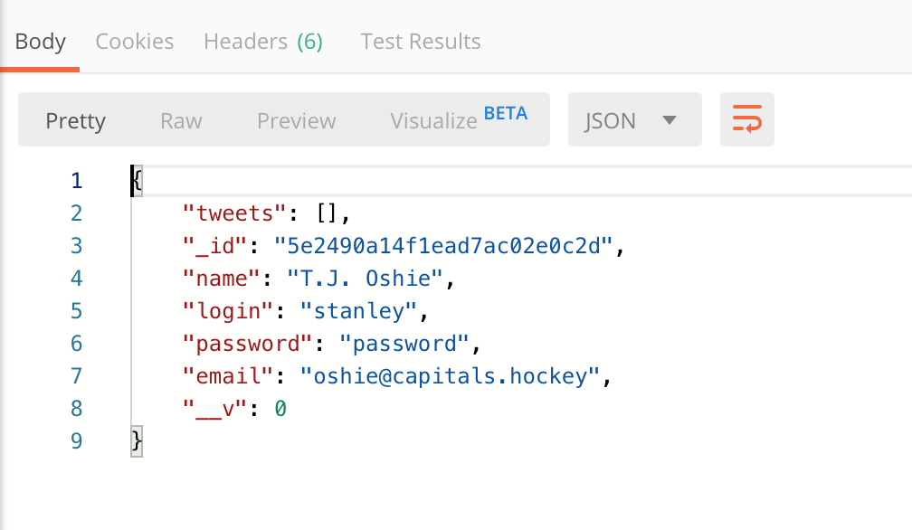
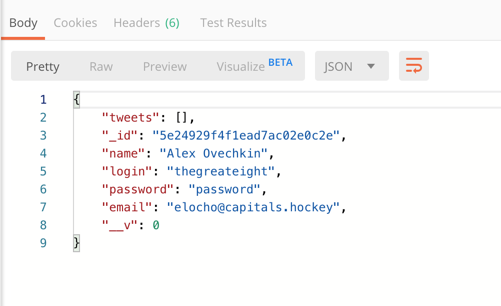
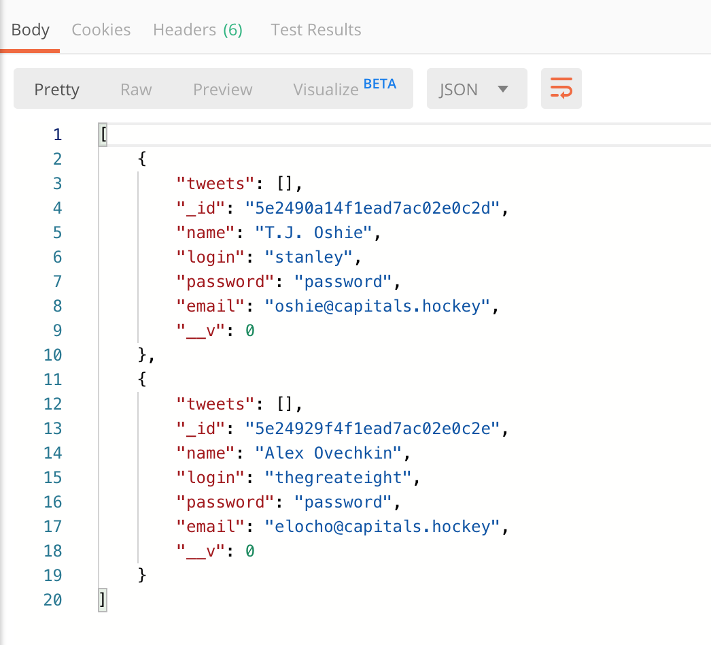
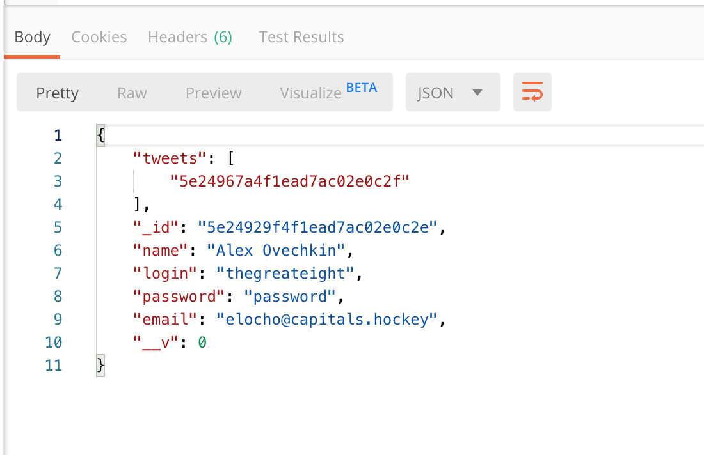
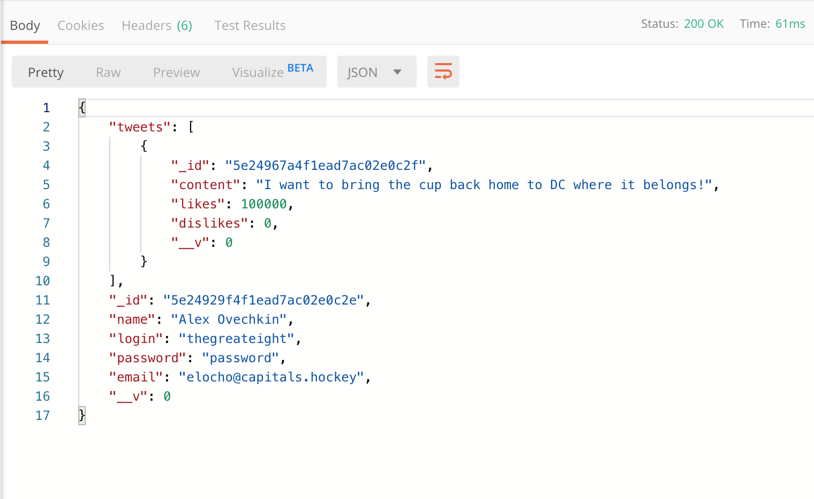

# Exercise 3: Building our own Twitter API

## Due Date: Tuesday, January 21, 2020 11:59 PM
## Objectives: To build a complete  API, including validations, schema, routing and controllers. Additionally learn about how to handle relational data in mongodb as well as user authentication.

## Overview
We will be building out a bare bones version of the twitter api. In this API you will be defining endpoints that allow you to create a user as well as create the tweets associated with that user. You will additionally be creating endpoints that will retrieve all the users stored in the database, all the tweets stored in the database and all the information for an individual user and their associated tweets.

## Project Implementation/Specifications
The files that comprise the API are `app.js`, the router files, the model schema and the controller files. The controller methods you will call in your router module have already been created for you. You will just need to invoke them along with the correct REST action at the specified endpoint. The files you will need to edit are the following:  
  1.  `App.js`  
  At the bottom of `App.js` paste in the teaching staff login name and password as well as the mongodb connection string you created in `Exercise 2`. The section of the url string that you need to update has been referenced directly where it goes. 
  2.  `User Schema`  
  You need to define the User Schema inside of `models/User.js`. A User has the following 5 fields:  
    * name - it should be a String and a required field.  
    * login - it should be a String and a required field. It represents the login a user will use to authenticate into the application system.  
    *  password - it should be a String and a required field. When you add user authentication to the application stack you will use the login and password combination to authenticate a user.  
    *  email - it should be a String and required.  
    *  tweets - it should be defined like this:  

```javascript
tweets: [{  
  type: Schema.Types.ObjectId,  
  ref: 'Tweet'  
}]  
```  
  3.  `Tweet Schema` 
  You need to define the Tweet Schema inside of `models/Tweet.js`. A Tweet has the following 3 fields:  
    * content - it should be defined as a String and required.  
    * likes - it should be defined as a Number and required.  
    * dislikes - it should be defined as a Number and required.  
    4.  `users router`  
    You need to define all of your routes(endpoints) inside of `routes/api/v1/Users.js`.  The callback you invoke in your functions that create the routes should be one of the functions exported in the `UserController` module. Additionally, any endpoint that creates a new resource should utilize the validator also defined inside of the `UserController` module.  
    You will need to define the following 5 endpoints:  
      * `/api/v1/users` - this will return all the documents inside the `users` collection.    
      * `/api/v1/user`  - this will generate a new user document inside of the `users` collection.   
      * `/api/v1/tweets` - this will return all the documents inside the `tweets` collection.   
      * `/api/v1/user/:id` - this will generate a new document inside the `tweets` collection as well as generate a reference to the document inside the `users` collection that has a value of `:id` for its `_id` field.   
      * `/api/v1/users/:id` - this will return the document that matches the `:id` request param as well as all the tweets that it references. __Note__: the operation that you will be performing in this endpoint inside of mongo is identical to a join method in a tradition SQL database.  


## Sample result outputs from postman  

successfully creating a user  

  
  
successfully creating a second user  

 

returning all the users  



create a tweet for a user 



retrieve all tweets  

  

retrieve a single user 

 
